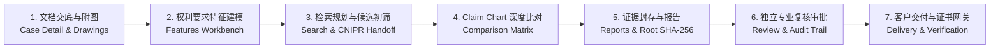

# PatentEvidence 🛡️

PatentEvidence is a high-assurance, multi-tenant enterprise SaaS platform designed for professional patent practitioners, litigation attorneys, and enterprise IP departments. It provides end-to-end traceable patent evidence workflows, automated claim modeling, intelligent prior art comparison matrices (Claim Charts), cryptographic Merkle Root SHA-256 evidence sealing, multi-round peer review approval flows, and secure client delivery gateways.

---

## 🚀 Core Product Capabilities & Workbenches



1. **多租户与身份安全（Identity & Multi-Tenancy）**
   - 机构隔离（PostgreSQL Row-Level Security 强制隔离）与单向审计日志不可变性；
   - 12 小时安全会话、TOTP 双因素认证（MFA Step-Up）、一次性恢复码与 72 小时单次邀请生命周期。

2. **案件交底与说明书附图提取（Case Intake & Drawings Gallery）**
   - 支持 DOCX 与文字版 PDF 解析、自动安全哈希计算与结构化段落分块；
   - 说明书附图（Figures）自动提取画廊与附图标记（Reference Marks）图文对照抽屉。

3. **权利要求技术特征建模（Claim Feature Modeling）**
   - 权利要求层级拆解（F1~Fn）、前序/表征特征分类与交底书段落原文锚定；
   - 支持草稿态在线拆分、合并与新增，一键确认并锁定为不可变基准版本。

4. **检索策略规划与 CNIPR 规范交接包（Search & CNIPR Handoff）**
   - 关键词矩阵、IPC 分类扩展与 CNIPR 规范布尔表达式生成；
   - 导出规范 Markdown / JSON 人工离线交接包，支持公开数据源检索初筛与法定排除理由留痕。

5. **2D 特征深度比对矩阵（Claim Chart Comparison Matrix）**
   - 权利要求特征与对比文献（D1~Dm）二维交叉比对矩阵；
   - 三态侵权判定（`相同公开` / `等同替代` / `存在差异`）、引证位置与法律论据结构化录入；
   - 特征文本附图标注智能匹配，全局新颖性与创造性风险 Banner 实时评估。

6. **证据链哈希封存与预评估报告（Merkle Root SHA-256 & Reports）**
   - 全案多源证据 Merkle Root SHA-256 不可变防伪根哈希计算与快照封存；
   - 结构化富文本 Markdown 分析与预评估报告在线生成与预览。

7. **独立专业复核与三审流转（Multi-round Review & Governance）**
   - 多轮提审流转（Round 1, Round 2...）、逐特征专家修改批注与退回高亮标记；
   - 单人执业自审合规警示与 SHA-256 决策数字签名防篡改留痕。

8. **客户交付网关与防伪下载凭证（Client Delivery & Verification Gateway）**
   - 登记客户委托方全称并一键锁定全案状态为已交付（`delivered`）；
   - 生成专用防伪交付证书（Delivery Certificate）与受控下载令牌（Token）。

---

## 🛠️ Local Development & Quick Start

### 1. Prerequisites
- **Python 3.12+** (managed with `uv`)
- **Node.js 20+** & **pnpm 9+**
- **PostgreSQL 16+** (with RLS support)

### 2. Environment Setup

```sh
# 1. Clone repository and setup environment file
cp .env.example .env

# 2. Install Python dependencies
uv sync --no-install-project

# 3. Install frontend dependencies
pnpm install
```

### 3. Running Validation Suite

```sh
# Run Python unit tests (22/22 passed)
.venv/bin/pytest apps/api/tests/unit/

# Run PostgreSQL RLS integration tests (81/81 passed)
./scripts/test-postgres.sh

# Run frontend Vitest suite (22/22 passed)
pnpm test:web

# Build production frontend bundle
pnpm build:web

# Run scaffold and provenance release gates
.venv/bin/python scripts/verify-source-lock.py
.venv/bin/python scripts/verify-scaffold.py
.venv/bin/python scripts/verify-p0-02.py
.venv/bin/python scripts/verify-p0-e2e.py

# Verify Docker Compose configuration
docker compose config > /dev/null
```

### 4. Starting the Development Stack

```sh
# Start PostgreSQL, API, and Worker via Docker Compose
docker compose up --build

# Or run frontend dev server locally
pnpm --filter @patent-evidence/web dev --port 5173
```

---

## 🏛️ Security & Governance Guidelines

- **租户数据强隔离（Tenant Isolation）**：所有数据库表均开启 PostgreSQL Row Level Security（RLS），任何跨租户数据访问均在数据库层强制拒绝。
- **不可变审计链（Immutable Provenance）**：证据快照与复核决策均绑定 SHA-256 数字摘要，禁止物理修改或覆盖已有记录。
- **合规边界（CNIPR Manual-Handoff）**：严格遵守 CNIPR 数据规范与人工交接隔离策略，确保法律证据链合法合规。
