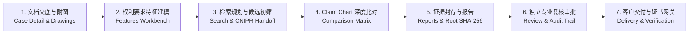

# PatentEvidence 🛡️

PatentEvidence is a high-assurance, multi-tenant enterprise SaaS platform designed for professional patent practitioners, litigation attorneys, and enterprise IP departments. It provides end-to-end traceable patent evidence workflows, automated claim modeling, intelligent prior art comparison matrices (Claim Charts), cryptographic Merkle Root SHA-256 evidence sealing, multi-round peer review approval flows, and secure client delivery gateways.

> **Language note:** Product capability descriptions are written in Chinese (the platform's primary operating language), while section headings, technical commands, and tooling references are kept in English. Domain terminology is defined authoritatively in [`CONTEXT.md`](./CONTEXT.md).

---

## 🚀 Core Product Capabilities & Workbenches



1. **多租户与身份安全（Identity & Multi-Tenancy）**
   - 机构隔离（PostgreSQL Row-Level Security 强制隔离）与单向审计日志不可变性；
   - 12 小时安全会话、TOTP 双因素认证（MFA Step-Up）、一次性恢复码与 72 小时单次邀请生命周期。

2. **Case Intake & Patent Drawings Gallery (案件交底与说明书附图高精度提炼)**
   - **High-Fidelity Drawing Extraction & Cryptographic Sealing**: Automated vector and raster image separation from DOCX/PDF with independent SHA-256 tamper-evident digest per drawing;
   - **Visual OCR & Specification Cross-Verification**: Local visual OCR engine cross-referenced with specification dictionary, supporting uppercase alphanumeric marks (e.g. `218A`~`218E`, `150A`~`150D`) and eliminating background noise marks to achieve 100% true alignment with drawing lead lines;
   - **Hierarchical Claim Linkage & Badges (独权 vs 从权)**: Deep claim number extraction (`claim_numbers: number[]`) distinguishing Independent Claim features (golden **`[独权1]`**) from Dependent Claim refinements (indigo-purple **`[从权6]`**), with canonical legal claim terminology prioritization;
   - **In-Situ Patent Compliance Linter (附图规范静态体检)**: Automated static audit for cross-figure naming drift (术语漂移), dangling claim marks (权项悬空标号), and undefined marks, rendered via an unobtrusive collapsible drawer above the gallery;
   - **Split CAD-Grade Workbench Layout**: 1140px split layout with left high-res canvas (zoom/pan, locked viewport `<= 66vh` to prevent vertical overflow) and right inspection panel with live search and filter pills.

3. **权利要求技术特征建模（Claim Feature Modeling）**
   - 权利要求层级拆解（F1~Fn）、前序/表征特征分类与交底书段落原文锚定；
   - 支持草稿态在线拆分、合并与新增，一键确认并锁定为不可变基准版本。

4. **检索策略规划与 CNIPR 规范交接包（Search & CNIPR Handoff）**
   - 关键词矩阵、IPC 分类扩展与 CNIPR 规范布尔表达式生成；
   - 导出规范 Markdown / JSON 人工离线交接包，支持公开数据源检索初筛与法定排除理由留痕。

5. **2D 特征深度比对矩阵（Claim Chart Comparison Matrix）**
   - 权利要求特征与对比文献（D1~Dm）二维交叉比对矩阵；
   - 三态侵权判定（`相同公开` / `等同替代` / `存在差异`）、引证位置与法律论据结构化录入；
   - 特征文本附图标注智能匹配，全局新颖性与创造性风险 Banner 实时评估。

6. **证据链哈希封存与预评估报告（Merkle Root SHA-256 & Reports）**
   - 全案多源证据 Merkle Root SHA-256 不可变防伪根哈希计算与快照封存；
   - 结构化富文本 Markdown 分析与预评估报告在线生成与预览。
   - 图纸、文档与报告原件统一存放于 MinIO 对象存储，内容寻址并绑定内容哈希，与数据库中的证据记录形成可交叉核验的完整证据链。

7. **独立专业复核与三审流转（Multi-round Review & Governance）**
   - 多轮提审流转（Round 1, Round 2...）、逐特征专家修改批注与退回高亮标记；
   - 单人执业自审合规警示与 SHA-256 决策数字签名防篡改留痕。

8. **客户交付网关与防伪下载凭证（Client Delivery & Verification Gateway）**
   - 登记客户委托方全称并一键锁定全案状态为已交付（`delivered`）；
   - 生成专用防伪交付证书（Delivery Certificate）与受控下载令牌（Token）。

---

## 📐 Project Structure & Tech Stack

**Tech stack**

| Layer | Technology |
| --- | --- |
| Backend API | Python 3.12, FastAPI, SQLAlchemy (async), Alembic |
| Background Worker | Python 3.12 (async job processing) |
| Frontend | React 19, TypeScript, Vite |
| Database | PostgreSQL 16 (Row-Level Security enforced) |
| Object Storage | MinIO (content-addressed evidence blobs) |
| Testing | pytest (API/worker), Vitest + React Testing Library (web) |
| Packaging | `uv` (Python), `pnpm` workspaces (Node) |

**Repository layout**

```
apps/            Deployable services
  api/           FastAPI application (src, alembic migrations, tests)
  web/           React + Vite single-page frontend
  worker/        Async background job processor
modules/         Domain logic, one package per capability:
                 cases, features, feature-modeling, search,
                 comparison, evidence, reports, review,
                 retrieval, delivery, assessment, platform
packages/        Shared cross-app libraries
scripts/         Ops tooling: seeding, bootstrap, verify-* release gates
db/              Database schemas, roles, and RLS policies
docs/            ADRs, API specs, architecture, compliance & validation notes
provenance/      Release provenance and source-lock artifacts
fixtures/        Deterministic test fixtures
```

---

## 🛠️ Local Development & Quick Start

### 1. Prerequisites
- **Python 3.12+** (managed with `uv`)
- **Node.js 20+** & **pnpm 9+**
- **PostgreSQL 16+** (with RLS support)

### 2. Environment Setup

```sh
# 1. Clone repository and setup environment file
cp .env.example .env

# 2. Install Python dependencies
uv sync --no-install-project

# 3. Install frontend dependencies
pnpm install
```

### 3. Running Validation Suite

```sh
# Run API unit tests (78/78 passed)
.venv/bin/pytest apps/api/tests/unit/

# Run PostgreSQL RLS integration tests (81/81 passed)
./scripts/test-postgres.sh

# Run frontend Vitest suite (23/23 passed)
pnpm test:web

# Build production frontend bundle
pnpm build:web

# Run scaffold and provenance release gates
.venv/bin/python scripts/verify-source-lock.py
.venv/bin/python scripts/verify-scaffold.py
.venv/bin/python scripts/verify-p0-02.py
.venv/bin/python scripts/verify-p0-e2e.py

# Verify Docker Compose configuration
docker compose config > /dev/null
```

### Optional Jev evidence judgments

Set `PATENT_EVIDENCE_JEV_API_KEY` only in the server environment to enable
TypeSafe/Jev judgments in the claim-comparison workflow. The default model alias
is `jev-latest`; override it with `PATENT_EVIDENCE_JEV_MODEL` when a validated,
pinned model is required. Without a key, comparisons are explicitly labelled as
`deterministic_baseline` and `insufficient_evidence`; the application does not
present heuristic title/abstract matching as a live Jev result.

Jev returns typed Choice, Noul, and Score probabilities. PatentEvidence keeps
the legal workflow deterministic: exact source-anchor validation, novelty's
single-reference/all-elements gate, the three-step inventiveness sequence, and
human approval remain application-controlled.

The same boundary now extends into the pre-assessment stage
(`modules/assessment/rules.py`, version-pinned `assessment-rules-v1`):
novelty single-reference/all-elements and combination-coverage gates,
evidence-completeness findings, and the three-step scaffold stay deterministic,
while `adapters/jev/motivation.py` contributes typed combination-motivation
signals (same field, same problem, motivation grade, technical prejudice) as
non-authoritative metadata — `requires_human_confirmation` is always true for
system-suggested combinations. Versioned assessment prompts
(`prompts/assessment/`: `novelty-v1`, `inventive-step-v1`, `originality-v1`)
pin the reviewed prompt that produced each result; `originality-v1` covers
copyright originality (独立完成 + 最低限度创造性, idea/expression dichotomy).

### 4. Starting the Development Stack

```sh
# Start PostgreSQL, API, Worker, Web, and MinIO via Docker Compose
docker compose up --build

# Or run frontend dev server locally
pnpm --filter @patent-evidence/web dev --port 5173
```

Once the stack is up:

| Service | Default URL |
| --- | --- |
| Web (Vite + React) | `http://localhost:5173` |
| API (FastAPI, health probe) | `http://localhost:8000` (`/health`) |
| MinIO object storage | `http://localhost:9000` (console `:9001`) |

Ports are overridable via `API_PORT`, `WEB_PORT`, etc. in `.env`.

---

## 🏛️ Security & Governance Guidelines

- **租户数据强隔离（Tenant Isolation）**：所有数据库表均开启 PostgreSQL Row Level Security（RLS），任何跨租户数据访问均在数据库层强制拒绝。
- **不可变审计链（Immutable Provenance）**：证据快照与复核决策均绑定 SHA-256 数字摘要，禁止物理修改或覆盖已有记录。
- **合规边界（CNIPR Manual-Handoff）**：严格遵守 CNIPR 数据规范与人工交接隔离策略，确保法律证据链合法合规。

---

## 📚 Documentation & Deep Dive

More detailed, authoritative documentation lives under [`docs/`](./docs):

| Area | Location |
| --- | --- |
| Architecture Decision Records (ADRs) | [`docs/adr/`](./docs/adr) |
| API specifications | [`docs/api/`](./docs/api) |
| System architecture & scaffolding | [`docs/architecture/`](./docs/architecture) |
| Compliance & validation notes | [`docs/compliance/`](./docs/compliance), [`docs/validation/`](./docs/validation) |
| Operations runbooks & local dev | [`docs/operations/`](./docs/operations) |
| Planning & product specs | [`docs/plans/`](./docs/plans), [`docs/product/`](./docs/product) |
| Verification & release evidence | [`docs/verification/`](./docs/verification) |
| Domain language glossary | [`CONTEXT.md`](./CONTEXT.md) |

Release provenance and source-lock artifacts are retained in [`provenance/`](./provenance).

---

## 📄 License

© 2026 PatentEvidence contributors. All rights reserved.

This repository is **proprietary and confidential** under the *PatentEvidence Commercial License*. No permission is granted to use, copy, modify, distribute, sublicense, or sell any portion of this repository without a separate written agreement from the copyright holder. See [`LICENSE`](./LICENSE) for the full terms.

Third-party components retain their own licenses, as documented in [`provenance/THIRD_PARTY_NOTICES.md`](./provenance/THIRD_PARTY_NOTICES.md).
