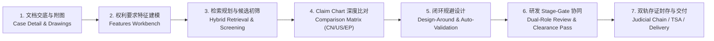

# PatentEvidence 🛡️

PatentEvidence is a high-assurance, multi-tenant enterprise SaaS platform engineered for **Enterprise IP & R&D departments in the New Energy & Energy Storage industry (covering structural assemblies & chemical formulations)**. It delivers end-to-end traceable "evidence-grade" patent workflows, automated claim feature modeling, intelligent Claim Chart infringement comparison matrices, **closed-loop auto-validated Design-Around engines**, **dual-role Stage-Gate clearance workflows**, **dual-track judicial & RFC 3161 TSA trusted timestamping**, and verifiable client delivery gateways.

> **Language note:** Product capability descriptions are written in Chinese (the platform's primary operating language), while section headings, technical commands, and tooling references are kept in English. Domain terminology is defined authoritatively in [`CONTEXT.md`](./CONTEXT.md). Master implementation blueprint is in [`docs/plans/2026-fto-design-around-master-plan.md`](./docs/plans/2026-fto-design-around-master-plan.md).

---

## 🏛️ Strategic Moats (四重竞争壁垒)

1. **Data Moat (Vertical Feature-Level Corpus)**: Focused on top 15 litigious battery/storage giants over the past 5 years (5,000~8,000 core valid patents), establishing an off-the-shelf fine-grained claim element taxonomy.
2. **Algorithmic Moat (Closed-Loop Auto-Validated Design-Around)**: Once redesign proposals are generated, the engine automatically re-checks them against the competitor's full claim tree and patent family to eliminate secondary infringement.
3. **Trust & Compliance Moat (Dual-Track Judicial Timestamping)**: Integrates Chinese judicial chains (e.g. Tianping Chain) for domestic proceedings, alongside international RFC 3161 TSA & public blockchain state hashes for US ITC Section 337 and European litigations.
4. **Workflow Moat (Dual-Role Stage-Gate Clearance)**: R&D submits and modifies designs, while IP Counsel verifies and signs off on immutable FTO Clearance Passes embedded into corporate PLM/ERP phase-gate milestones.

---

## 🚀 Core Product Capabilities & Workbenches


```mermaid
graph LR
    A["1. 文档交底与附图<br/>Case Detail & Drawings"] --> B["2. 权利要求特征建模<br/>Features Workbench"]
    B --> C["3. 检索规划与候选初筛<br/>Hybrid Retrieval & Screening"]
    C --> D["4. Claim Chart 深度比对<br/>Comparison Matrix (CN/US/EP)"]
    D --> E["5. 闭环规避设计<br/>Design-Around & Auto-Validation"]
    E --> F["6. 研发 Stage-Gate 协同<br/>Dual-Role Review & Clearance Pass"]
    F --> G["7. 双轨存证封存与交付<br/>Judicial Chain / TSA / Delivery"]
```

1. **多租户与平台治理（Identity & Platform Governance）**
   - 机构隔离（PostgreSQL Row-Level Security 强制隔离）与单向审计日志不可变性；
   - 12 小时安全会话、TOTP 双因素认证（MFA Step-Up）、一次性恢复码与 72 小时单次邀请生命周期；
   - 支持客户自管密钥（BYOK）与密文存储，配合大模型敏感度双路由实现零数据留存。

2. **Case Intake & Patent Drawings Gallery (案件交底与说明书附图高精度提炼)**
   - **High-Fidelity Drawing Extraction & Cryptographic Sealing**: Automated vector and raster image separation from DOCX/PDF with independent SHA-256 tamper-evident digest per drawing;
   - **Visual OCR & Specification Cross-Verification**: Local visual OCR engine cross-referenced with specification dictionary, supporting uppercase alphanumeric marks (e.g. `218A`~`218E`, `150A`~`150D`) and eliminating background noise marks to achieve 100% true alignment with drawing lead lines;
   - **Hierarchical Claim Linkage & Badges (独权 vs 从权)**: Deep claim number extraction (`claim_numbers: number[]`) distinguishing Independent Claim features (golden **`[独权1]`**) from Dependent Claim refinements (indigo-purple **`[从权6]`**), with canonical legal claim terminology prioritization;
   - **In-Situ Patent Compliance Linter (附图规范静态体检)**: Automated static audit for cross-figure naming drift (术语漂移), dangling claim marks (权项悬空标号), and undefined marks, rendered via an unobtrusive collapsible drawer above the gallery;
   - **Split CAD-Grade Workbench Layout**: 1140px split layout with left high-res canvas (zoom/pan, locked viewport `<= 66vh` to prevent vertical overflow) and right inspection panel with live search and filter pills.

3. **权利要求技术特征建模（Claim Feature Modeling）**
   - 权利要求层级拆解（F1~Fn）、前序/表征特征分类与交底书段落原文锚定；
   - 支持草稿态在线拆分、合并与新增，一键确认并锁定为不可变基准版本。

4. **候选专利初筛与混合检索（Hybrid Retrieval & Screening）**
   - 研发白话方案自动解构（提取核心部件、空间装配与功能功效）；
   - 密集向量检索（Dense Embedding） + 稀疏关键词（BM25） + 分类号过滤的多路并行召回，结合 Cross-Encoder 深度重排，输出 Top 20~30 件竞品高危专利。

5. **2D 特征深度比对矩阵（Claim Chart Comparison Matrix）**
   - 权利要求特征与对比文献（D1~Dm）二维交叉比对矩阵，适配中国（全面覆盖+等同）、美国（全要素+等同+审查历史禁反悔）、欧洲（UPC + 德国）法域规则包；
   - 三态侵权判定（`相同公开` / `等同替代` / `存在差异`）、引证位置与法律论据结构化录入；
   - 特征文本附图标注智能匹配，全局新颖性与创造性风险 Banner 实时评估。

6. **闭环反向验真规避设计（Design-Around & Auto-Validation Engine）**
   - 针对 Claim Chart 中识别的断点特征，生成结构化替代/削减工程改动建议；
   - **反向闭环排查**：自动将改动方案放回竞品从属权利要求树与同族专利池重新比对，严防“二次落入”风险。

7. **确定性可专利性与侵权预评估规则层（Patentability & Assessment Rules）**
   - 确定性门禁（版本 `assessment-rules-v3`）：优先权核验（多项 / 部分优先权、期限、首次申请、证明核验）→ 文献日期门禁（现有技术 / 抵触申请 / 不可用 / 日期未知，按特征逐项判断）→ 新颖性单篇全覆盖门禁、组合覆盖筛查、证据完备度核查与创造性三步法脚手架；
   - 证据完备度区分「阻塞项」与「提示项」，统一编排入口 `assess_case()`，产出评估包与评估版本快照（`assessment_versions`，仅追加不可改）。

8. **研发 Stage-Gate 门禁流与双角色协同（Dual-Role Stage-Gate Clearance）**
   - 研发工程师提方案与整改，IP 工程师复核打标与终审放行；
   - 签发不可逆的《FTO 清障通行凭证》，嵌入企业 ERP/PLM 立项、开模节点；
   - 多轮提审流转（Round 1, Round 2...）、逐特征专家修改批注与退回高亮标记。

9. **双轨证据链存证与客户交付（Merkle Tree, TSA & Delivery Gateway）**
   - 全案 Merkle Root SHA-256 根哈希计算与快照封存；
   - 国内权威司法链（如天平链）与国际 RFC 3161 TSA / 公链哈希双轨时间戳存证；
   - 生成专用防伪交付证书（Delivery Certificate）与受控下载令牌（Token），支持外部持证律师入驻复核签署。


---

## 📐 Project Structure & Tech Stack

**Tech stack**

| Layer | Technology |
| --- | --- |
| Backend API | Python 3.12, FastAPI, SQLAlchemy (async), Alembic |
| Background Worker | Python 3.12 (async job processing) |
| Frontend | React 19, TypeScript, Vite |
| Database | PostgreSQL 16 (Row-Level Security enforced) |
| Object Storage | MinIO (content-addressed evidence blobs) |
| Testing | pytest (API/worker), Vitest + React Testing Library (web) |
| Packaging | `uv` (Python), `pnpm` workspaces (Node) |

**Repository layout**

```
apps/            Deployable services
  api/           FastAPI application (src, alembic migrations, tests)
  web/           React + Vite single-page frontend
  worker/        Async background job processor
modules/         Domain logic, one package per capability:
                 cases, features, feature-modeling, search,
                 comparison, evidence, reports, review,
                 retrieval, delivery, assessment, platform
packages/        Shared cross-app libraries
scripts/         Ops tooling: seeding, bootstrap, verify-* release gates
db/              Database schemas, roles, and RLS policies
docs/            ADRs, API specs, architecture, compliance & validation notes
provenance/      Release provenance and source-lock artifacts
fixtures/        Deterministic test fixtures
```

---

## 🛠️ Local Development & Quick Start

### 1. Prerequisites
- **Python 3.12+** (managed with `uv`)
- **Node.js 20+** & **pnpm 9+**
- **PostgreSQL 16+** (with RLS support)

### 2. Environment Setup

```sh
# 1. Clone repository and setup environment file
cp .env.example .env

# 2. Install Python dependencies
uv sync --no-install-project

# 3. Install frontend dependencies
pnpm install
```

### 3. Running Validation Suite

```sh
# Run API unit tests (261/261 passed)
.venv/bin/pytest apps/api/tests/unit/

# Run PostgreSQL RLS integration tests (81/81 passed)
./scripts/test-postgres.sh

# Run frontend Vitest suite (59/59 passed)
pnpm test:web

# Build production frontend bundle
pnpm build:web

# Run scaffold and provenance release gates
.venv/bin/python scripts/verify-source-lock.py
.venv/bin/python scripts/verify-scaffold.py
.venv/bin/python scripts/verify-p0-02.py
.venv/bin/python scripts/verify-p0-e2e.py

# Verify Docker Compose configuration
docker compose config > /dev/null
```

### 4. Starting the Development Stack

```sh
# Start PostgreSQL, API, Worker, Web, and MinIO via Docker Compose
docker compose up --build

# Or run frontend dev server locally
pnpm --filter @patent-evidence/web dev --port 5173
```

Once the stack is up:

| Service | Default URL |
| --- | --- |
| Web (Vite + React) | `http://localhost:5173` |
| API (FastAPI, health probe) | `http://localhost:8000` (`/health`) |
| MinIO object storage | `http://localhost:9000` (console `:9001`) |

Ports are overridable via `API_PORT`, `WEB_PORT`, etc. in `.env`.

---

## 🏛️ Security & Governance Guidelines

- **租户数据强隔离（Tenant Isolation）**：所有数据库表均开启 PostgreSQL Row Level Security（RLS），任何跨租户数据访问均在数据库层强制拒绝。
- **不可变审计链（Immutable Provenance）**：证据快照与复核决策均绑定 SHA-256 数字摘要，禁止物理修改或覆盖已有记录。
- **合规边界（CNIPR Manual-Handoff）**：严格遵守 CNIPR 数据规范与人工交接隔离策略，确保法律证据链合法合规。

---

## 📚 Documentation & Deep Dive

More detailed, authoritative documentation lives under [`docs/`](./docs):

| Area | Location |
| --- | --- |
| Architecture Decision Records (ADRs) | [`docs/adr/`](./docs/adr) |
| API specifications | [`docs/api/`](./docs/api) |
| System architecture & scaffolding | [`docs/architecture/`](./docs/architecture) |
| Compliance & validation notes | [`docs/compliance/`](./docs/compliance), [`docs/validation/`](./docs/validation) |
| Operations runbooks & local dev | [`docs/operations/`](./docs/operations) |
| Planning & product specs | [`docs/plans/`](./docs/plans), [`docs/product/`](./docs/product) |
| **Master Implementation Blueprint** | [`docs/plans/2026-fto-design-around-master-plan.md`](./docs/plans/2026-fto-design-around-master-plan.md) |
| Domain language glossary | [`CONTEXT.md`](./CONTEXT.md) |

Release provenance and source-lock artifacts are retained in [`provenance/`](./provenance).

---

## 📄 License

© 2026 PatentEvidence contributors. All rights reserved.

This repository is **proprietary and confidential** under the *PatentEvidence Commercial License*. No permission is granted to use, copy, modify, distribute, sublicense, or sell any portion of this repository without a separate written agreement from the copyright holder. See [`LICENSE`](./LICENSE) for the full terms.

Third-party components retain their own licenses, as documented in [`provenance/THIRD_PARTY_NOTICES.md`](./provenance/THIRD_PARTY_NOTICES.md).
