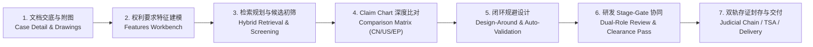

# PatentEvidence 🛡️

PatentEvidence is a high-assurance, multi-tenant enterprise SaaS platform engineered for **Enterprise IP & R&D departments in the New Energy & Energy Storage industry (covering structural assemblies & chemical formulations)**. Its target product is an evidence-grade FTO and design-around workflow: claim charts against third-party claims, closed-loop design-around validation, dual-role Stage-Gate clearance, and dual-track trusted timestamping ([ADR 0004](./docs/adr/0004-fto-design-around-supersedes-agency-assessment.md)).

> **Implementation status:** many of these capabilities are **planned, not built**. The platform base (tenancy, RLS, MFA, audit), case intake, feature modeling, comparison matrix, review/delivery gates, sealed snapshots and verifiable DOCX/PDF exports exist today. Hybrid retrieval, FTO infringement rule packs, design-around, trusted timestamping, BYOK and Stage-Gate clearance passes do not. Each capability below is labelled **【已实现】**, **【部分实现】** or **【规划中】**, based on the code as checked on 2026-10-04.

> **Language note:** Product capability descriptions are written in Chinese (the platform's primary operating language), while section headings, technical commands, and tooling references are kept in English. Domain terminology is defined authoritatively in [`CONTEXT.md`](./CONTEXT.md). Master implementation blueprint is in [`docs/plans/2026-fto-design-around-master-plan.md`](./docs/plans/2026-fto-design-around-master-plan.md).

---

## 🏛️ Strategic Moats (四重竞争壁垒) — 目标，均为【规划中】

These are the intended competitive moats from the master plan. None of them is implemented yet, and the corpus size below is a planning figure that has not been verified (see ADR 0004 "待核实事项").

1. **Data Moat (Vertical Feature-Level Corpus)**: Focused on top 15 litigious battery/storage giants over the past 5 years (5,000~8,000 core valid patents), establishing an off-the-shelf fine-grained claim element taxonomy.
2. **Algorithmic Moat (Closed-Loop Auto-Validated Design-Around)**: Once redesign proposals are generated, the engine automatically re-checks them against the competitor's full claim tree and patent family to eliminate secondary infringement.
3. **Trust & Compliance Moat (Dual-Track Judicial Timestamping)**: Integrates Chinese judicial chains (e.g. Tianping Chain) for domestic proceedings, alongside international RFC 3161 TSA & public blockchain state hashes for US ITC Section 337 and European litigations.
4. **Workflow Moat (Dual-Role Stage-Gate Clearance)**: R&D submits and modifies designs, while IP Counsel verifies and signs off on immutable FTO Clearance Passes embedded into corporate PLM/ERP phase-gate milestones.

---

## 🚀 Core Product Capabilities & Workbenches


```mermaid
graph LR
    A["1. 文档交底与附图<br/>Case Detail & Drawings"] --> B["2. 权利要求特征建模<br/>Features Workbench"]
    B --> C["3. 检索规划与候选初筛<br/>Hybrid Retrieval & Screening"]
    C --> D["4. Claim Chart 深度比对<br/>Comparison Matrix (CN/US/EP)"]
    D --> E["5. 闭环规避设计<br/>Design-Around & Auto-Validation"]
    E --> F["6. 研发 Stage-Gate 协同<br/>Dual-Role Review & Clearance Pass"]
    F --> G["7. 双轨存证封存与交付<br/>Judicial Chain / TSA / Delivery"]
```

1. **多租户与平台治理（Identity & Platform Governance）**
   - 【已实现】机构隔离（PostgreSQL FORCE RLS）、只追加审计日志；12 小时会话、TOTP 双因素（MFA Step-Up）、一次性恢复码、72 小时单次邀请。
   - 【规划中】客户自管密钥（BYOK）与密文存储（`adapters/secret-store` 目前仅为占位）；大模型敏感度双路由与零数据留存（当前为单一 OpenAI 兼容客户端）。

2. **案件录入与说明书附图（Case Intake & Drawings）**
   - 【已实现】DOCX/PDF 上传与服务端内容检查（真实类型、大小、宏/DDE/远程模板/PDF 动作等；常见主动内容接收并记录）；解析版本与 SHA-256。
   - 【已实现】附图提取（每幅附图独立 SHA-256）、权利要求编号关联（独权/从权标识）、附图规范静态检查（术语漂移、悬空标号、未定义标号）。
   - 【部分实现】附图 OCR 依赖宿主机 `tesseract`；API 镜像未安装该程序，生产镜像中 OCR 不运行。附图标号识别准确率尚无评测数据，不作表述。

3. **技术特征建模（Feature Modeling）**
   - 【已实现】特征拆解（F1~Fn）、前序/表征分类与段落原文锚定；草稿态拆分/合并/新增，确认后锁定为不可变版本。
   - 【规划中】FTO 所需的“第三方权利要求要素”模型（按权利要求树逐要素拆解）。

4. **检索与候选初筛（Retrieval & Screening）**
   - 【已实现】检索策略与任务、EPO / USPTO 适配器、CNIPR 人工交接、候选文献初筛记录。
   - 【规划中】垂直专利库；向量检索 + BM25 + 分类号过滤的混合召回与 Cross-Encoder 重排（目前无 pgvector、无中文分词）；研发白话方案自动解构。

5. **逐特征比对矩阵（Comparison Matrix）**
   - 【已实现】特征 × 对比文献的二维比对矩阵，三态判定（相同公开 / 等同替代 / 存在差异）及引证位置录入。当前语义为可专利性比对（申请方案特征 vs 现有技术）。
   - 【规划中】FTO 侵权比对（他人有效权利要求各要素 vs 己方方案）及中国 / 美国 / 欧洲（UPC、德国）法域规则包。具体判定规则须由规则包定义并经专业人员审定。

6. **闭环反向验真规避设计（Design-Around & Auto-Validation）**
   - 【规划中】针对断点特征生成替代/削减建议，并自动回比从属权利要求树与同族专利池。

7. **可专利性预评估规则层（Patentability Assessment Rules）** — 【已实现，已冻结】
   - 确定性规则（`assessment-rules-v3`）：优先权核验 → 文献日期门禁 → 新颖性单篇全覆盖门禁、组合覆盖筛查、证据完备度核查与创造性三步法脚手架；评估版本快照仅追加不可改。按 ADR 0004，该模块不再扩展。

8. **复核门禁与双角色协同（Review & Stage-Gate）**
   - 【已实现】多轮提审（`round_number`）、复核决定与逐项批注、案件级交付门禁（须有已批准且无阻塞项的评估版本）。
   - 【规划中】研发/IP 双角色 Stage-Gate、《FTO 清障通行凭证》、与 ERP/PLM 的集成。

9. **证据封存与交付（Evidence Sealing & Delivery）**
   - 【已实现】证据快照封存：对规范化（键排序）JSON 计算单一 SHA-256 根哈希。注意：这不是 Merkle 树，不提供逐项包含性证明。
   - 【已实现】可复核导出：DOCX / PDF / 可打印 HTML，页脚含快照版本号与根哈希；同一快照导出字节确定，文件 SHA-256 经响应头返回并写入审计日志。交付记录含受控下载令牌。
   - 【规划中】国内司法链 / 可信时间戳与 RFC 3161 TSA 双轨存证、交付证书、外部持证律师复核签署。

---

## 📐 Project Structure & Tech Stack

**Tech stack**

| Layer | Technology |
| --- | --- |
| Backend API | Python 3.12, FastAPI, SQLAlchemy (async), Alembic |
| Background Worker | Python 3.12 (async job processing) |
| Frontend | React 19, TypeScript, Vite |
| Database | PostgreSQL 16 (Row-Level Security enforced) |
| Object Storage | MinIO (content-addressed evidence blobs) |
| Testing | pytest (API/worker), Vitest + React Testing Library (web) |
| Packaging | `uv` (Python), `pnpm` workspaces (Node) |

**Repository layout**

```
apps/            Deployable services
  api/           FastAPI application (src, alembic migrations, tests)
  web/           React + Vite single-page frontend
  worker/        Async background job processor
modules/         Domain logic, one package per capability:
                 cases, features, feature-modeling, search,
                 comparison, evidence, reports, review,
                 retrieval, delivery, assessment, platform
packages/        Shared cross-app libraries
scripts/         Ops tooling: seeding, bootstrap, verify-* release gates
db/              Database schemas, roles, and RLS policies
docs/            ADRs, API specs, architecture, compliance & validation notes
provenance/      Release provenance and source-lock artifacts
fixtures/        Deterministic test fixtures
```

---

## 🛠️ Local Development & Quick Start

### 1. Prerequisites
- **Python 3.12+** (managed with `uv`)
- **Node.js 20+** & **pnpm 9+**
- **PostgreSQL 16+** (with RLS support)

### 2. Environment Setup

```sh
# 1. Clone repository and setup environment file
cp .env.example .env

# 2. Install Python dependencies
uv sync --no-install-project

# 3. Install frontend dependencies
pnpm install
```

### 3. Running Validation Suite

```sh
# Run API unit tests
.venv/bin/pytest apps/api/tests/unit/

# Run PostgreSQL RLS integration tests
./scripts/test-postgres.sh

# Run frontend Vitest suite
pnpm test:web

# Build production frontend bundle
pnpm build:web

# Run scaffold and provenance release gates
.venv/bin/python scripts/verify-source-lock.py
.venv/bin/python scripts/verify-scaffold.py
.venv/bin/python scripts/verify-p0-02.py
.venv/bin/python scripts/verify-p0-e2e.py

# Verify Docker Compose configuration
docker compose config > /dev/null
```

### 4. Starting the Development Stack

```sh
# Start PostgreSQL, API, Worker, Web, and MinIO via Docker Compose
docker compose up --build

# Or run frontend dev server locally
pnpm --filter @patent-evidence/web dev --port 5173
```

Once the stack is up:

| Service | Default URL |
| --- | --- |
| Web (Vite + React) | `http://localhost:5173` |
| API (FastAPI, health probe) | `http://localhost:8000` (`/health`) |
| MinIO object storage | `http://localhost:9000` (console `:9001`) |

Ports are overridable via `API_PORT`, `WEB_PORT`, etc. in `.env`.

---

## 🏛️ Security & Governance Guidelines

- **租户数据强隔离（Tenant Isolation）**：所有数据库表均开启 PostgreSQL Row Level Security（RLS），任何跨租户数据访问均在数据库层强制拒绝。
- **不可变审计链（Immutable Provenance）**：证据快照与复核决策均绑定 SHA-256 数字摘要，禁止物理修改或覆盖已有记录。
- **合规边界（CNIPR Manual-Handoff）**：严格遵守 CNIPR 数据规范与人工交接隔离策略，确保法律证据链合法合规。

---

## 📚 Documentation & Deep Dive

More detailed, authoritative documentation lives under [`docs/`](./docs):

| Area | Location |
| --- | --- |
| Architecture Decision Records (ADRs) | [`docs/adr/`](./docs/adr) |
| API specifications | [`docs/api/`](./docs/api) |
| System architecture & scaffolding | [`docs/architecture/`](./docs/architecture) |
| Compliance & validation notes | [`docs/compliance/`](./docs/compliance), [`docs/validation/`](./docs/validation) |
| Operations runbooks & local dev | [`docs/operations/`](./docs/operations) |
| Planning & product specs | [`docs/plans/`](./docs/plans), [`docs/product/`](./docs/product) |
| **Master Implementation Blueprint** | [`docs/plans/2026-fto-design-around-master-plan.md`](./docs/plans/2026-fto-design-around-master-plan.md) |
| Domain language glossary | [`CONTEXT.md`](./CONTEXT.md) |

Release provenance and source-lock artifacts are retained in [`provenance/`](./provenance).

---

## 📄 License

© 2026 PatentEvidence contributors. All rights reserved.

This repository is **proprietary and confidential** under the *PatentEvidence Commercial License*. No permission is granted to use, copy, modify, distribute, sublicense, or sell any portion of this repository without a separate written agreement from the copyright holder. See [`LICENSE`](./LICENSE) for the full terms.

Third-party components retain their own licenses, as documented in [`provenance/THIRD_PARTY_NOTICES.md`](./provenance/THIRD_PARTY_NOTICES.md).
