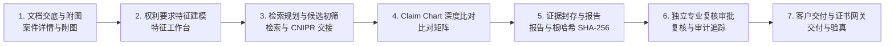

# PatentEvidence 🛡️

PatentEvidence 是一个面向专利代理人、诉讼律师与企业知识产权部门的高保障、多租户企业级 SaaS 平台。它提供端到端可溯源的专利证据工作流、自动化权利要求建模、智能现有技术比对矩阵（Claim Chart）、基于密码学 Merkle Root SHA-256 的证据封存、多轮同行评审审批流，以及安全的客户交付网关。

> **语言说明：** 本中文版为功能与操作说明的完整中文呈现。权威领域术语定义见 [`CONTEXT.md`](./CONTEXT.md)。英文原版见 [`README.md`](./README.md)。

---

## 🚀 核心产品能力与工作流



1. **多租户与身份安全（身份与多租户）**
   - 机构隔离（PostgreSQL 行级安全 RLS 强制隔离）与单向不可变审计日志；
   - 12 小时安全会话、TOTP 双因素认证（MFA Step-Up）、一次性恢复码与 72 小时单次邀请生命周期。

2. **案件交底与说明书附图高精度提炼（案件受理与专利附图画廊）**
   - **高保真图纸解析与哈希存证**：支持 DOCX 与文字版 PDF 矢量/光栅图纸智能分离，每张附图均计算独立 SHA-256 哈希存证；
   - **视觉 OCR 字模与说明书字典双重交叉核验**：采用本地视觉字模 OCR 与正文词典交叉验证，支持大写英文字母标号（如 `218A`~`218E`、`150A`~`150D`），彻底剔除非本图引出的背景干扰项，确保与图纸引出线 100% 严格真实对齐；
   - **权利要求层级化穿透与独权/从权分级徽章**：深度解析权利要求各条（Claim 1~N），将标记关联到具体权项编号，并区分独立权利要求核心保护特征（金黄色 **`[独权1]`**）与从属权利要求防守特征（蓝紫色 **`[从权6]`**），悬停即显完整法律条文归属；
   - **附图标记合规性静态体检器（Patent Linter）**：全自动扫描全案跨图命名漂移（同一标号在不同图纸名称不一致）、权项悬空标号（权项提到但附图缺失）及未定义构件，画廊顶部提供轻量级可就地折叠展开的体检建议栏；
   - **专业“左图右文”工作台视口布局**：弹窗全面升级为 1140px 左右分栏工作台，左侧高清图纸居中呈现（自适应锁定 66vh，支持平移缩放），右侧审查看板独立垂直滚动，配备即时检索框与 `全部` / `⭐ 权利要求特征` 一键切换胶囊，彻底解决垂直超长撑屏问题。

3. **权利要求技术特征建模（权利要求特征建模）**
   - 权利要求层级拆解（F1~Fn）、前序/表征特征分类与交底书段落原文锚定；
   - 支持草稿态在线拆分、合并与新增，一键确认并锁定为不可变基准版本。

4. **检索策略规划与 CNIPR 规范交接包（检索与 CNIPR 交接）**
   - 关键词矩阵、IPC 分类扩展与 CNIPR 规范布尔表达式生成；
   - 导出规范 Markdown / JSON 人工离线交接包，支持公开数据源检索初筛与法定排除理由留痕。

5. **2D 特征深度比对矩阵（Claim Chart 比对矩阵）**
   - 权利要求特征与对比文献（D1~Dm）二维交叉比对矩阵；
   - 三态侵权判定（`相同公开` / `等同替代` / `存在差异`）、引证位置与法律论据结构化录入；
   - 特征文本附图标注智能匹配，全局新颖性与创造性风险 Banner 实时评估。

6. **证据链哈希封存与预评估报告（Merkle Root SHA-256 与报告）**
   - 全案多源证据 Merkle Root SHA-256 不可变防伪根哈希计算与快照封存；
   - 结构化富文本 Markdown 分析与预评估报告在线生成与预览。
   - 图纸、文档与报告原件统一存放于 MinIO 对象存储，内容寻址并绑定内容哈希，与数据库中的证据记录形成可交叉核验的完整证据链。

7. **独立专业复核与三审流转（多轮复核与治理）**
   - 多轮提审流转（Round 1, Round 2...）、逐特征专家修改批注与退回高亮标记；
   - 单人执业自审合规警示与 SHA-256 决策数字签名防篡改留痕。

8. **客户交付网关与防伪下载凭证（客户交付与验真网关）**
   - 登记客户委托方全称并一键锁定全案状态为已交付（`delivered`）；
   - 生成专用防伪交付证书（Delivery Certificate）与受控下载令牌（Token）。

---

## 📐 项目结构与技术栈

**技术栈**

| 层级 | 技术 |
| --- | --- |
| 后端 API | Python 3.12、FastAPI、SQLAlchemy (async)、Alembic |
| 后台 Worker | Python 3.12（异步任务处理） |
| 前端 | React 19、TypeScript、Vite |
| 数据库 | PostgreSQL 16（强制行级安全 RLS） |
| 对象存储 | MinIO（内容寻址证据对象） |
| 测试 | pytest（API/worker）、Vitest + React Testing Library（web） |
| 打包工具 | `uv`（Python）、`pnpm` workspaces（Node） |

**仓库目录结构**

```
apps/            可部署服务
  api/           FastAPI 应用（src、alembic 迁移、tests）
  web/           React + Vite 单页前端
  worker/        异步后台任务处理器
modules/         领域逻辑，一个能力一个包：
                 cases、features、feature-modeling、search、
                 comparison、evidence、reports、review、
                 retrieval、delivery、assessment、platform
packages/        跨应用共享库
scripts/         运维工具：种子、引导、verify-* 发布门禁
db/              数据库 schema、角色与 RLS 策略
docs/            ADR、API 规范、架构、合规与验证说明
provenance/      发布溯源与源码锁定工件
fixtures/        确定性测试夹具
```

---

## 🛠️ 本地开发与快速开始

### 1. 前置条件
- **Python 3.12+**（使用 `uv` 管理）
- **Node.js 20+** 与 **pnpm 9+**
- **PostgreSQL 16+**（支持行级安全 RLS）

### 2. 环境配置

```sh
# 1. 克隆仓库并配置环境文件
cp .env.example .env

# 2. 安装 Python 依赖
uv sync --no-install-project

# 3. 安装前端依赖
pnpm install
```

### 3. 运行验证套件

```sh
# 运行 API 单元测试 (47/47 通过)
.venv/bin/pytest apps/api/tests/unit/

# 运行 PostgreSQL RLS 集成测试 (81/81 通过)
./scripts/test-postgres.sh

# 运行前端 Vitest 套件 (22/22 通过)
pnpm test:web

# 构建生产前端产物
pnpm build:web

# 运行脚手架与源码锁定发布门禁
.venv/bin/python scripts/verify-source-lock.py
.venv/bin/python scripts/verify-scaffold.py
.venv/bin/python scripts/verify-p0-02.py
.venv/bin/python scripts/verify-p0-e2e.py

# 校验 Docker Compose 配置
docker compose config > /dev/null
```

### 4. 启动开发环境

```sh
# 通过 Docker Compose 启动 PostgreSQL、API、Worker、Web 与 MinIO
docker compose up --build

# 或在本地单独运行前端开发服务器
pnpm --filter @patent-evidence/web dev --port 5173
```

环境启动后：

| 服务 | 默认地址 |
| --- | --- |
| Web（Vite + React） | `http://localhost:5173` |
| API（FastAPI，健康探针） | `http://localhost:8000`（`/health`） |
| MinIO 对象存储 | `http://localhost:9000`（控制台 `:9001`） |

端口可通过 `.env` 中的 `API_PORT`、`WEB_PORT` 等变量覆盖。

---

## 🏛️ 安全与治理准则

- **租户数据强隔离（租户隔离）**：所有数据库表均开启 PostgreSQL 行级安全（RLS），任何跨租户数据访问均在数据库层强制拒绝。
- **不可变审计链（不可变溯源）**：证据快照与复核决策均绑定 SHA-256 数字摘要，禁止物理修改或覆盖已有记录。
- **合规边界（CNIPR 人工交接）**：严格遵守 CNIPR 数据规范与人工交接隔离策略，确保法律证据链合法合规。

---

## 📚 文档与深入资料

更详细、权威的文档位于 [`docs/`](./docs) 目录下：

| 领域 | 位置 |
| --- | --- |
| 架构决策记录（ADR） | [`docs/adr/`](./docs/adr) |
| API 规范 | [`docs/api/`](./docs/api) |
| 系统架构与脚手架 | [`docs/architecture/`](./docs/architecture) |
| 合规与验证说明 | [`docs/compliance/`](./docs/compliance)、[`docs/validation/`](./docs/validation) |
| 运维手册与本地开发 | [`docs/operations/`](./docs/operations) |
| 规划与产品规格 | [`docs/plans/`](./docs/plans)、[`docs/product/`](./docs/product) |
| 验证与发布证据 | [`docs/verification/`](./docs/verification) |
| 领域语言术语表 | [`CONTEXT.md`](./CONTEXT.md) |

发布溯源与源码锁定工件保留于 [`provenance/`](./provenance)。

---

## 📄 许可证

© 2026 PatentEvidence 贡献者。版权所有。

本仓库为**专有且保密**内容，受 *PatentEvidence 商业许可* 约束。未经版权方另行书面协议，不得对本仓库任何部分进行使用、复制、修改、分发、再许可或出售。完整条款见 [`LICENSE`](./LICENSE)。

第三方组件保留其各自许可证，详见 [`provenance/THIRD_PARTY_NOTICES.md`](./provenance/THIRD_PARTY_NOTICES.md)。
