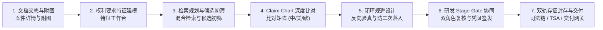

# PatentEvidence 🛡️

PatentEvidence 是一个面向**锂电与储能产业链（涵盖结构件与材料化工）**、服务于**企业知识产权部（IP）与研发团队（R&D）**的高保障企业级 SaaS 平台。它提供端到端可溯源的“证据级”专利工作流、自动化权利要求特征建模、智能 Claim Chart 侵权比对矩阵、**闭环反向验真规避设计（Design-Around）**、**研发 Stage-Gate 门禁协同流**、**双轨司法与 RFC 3161 TSA 可信时间戳存证**、多轮同行评审审批流，以及安全的客户交付网关。

> **语言说明：** 本中文版为功能与操作说明的完整中文呈现。权威领域术语定义见 [`CONTEXT.md`](./CONTEXT.md)。完整实施蓝图见 [`docs/plans/2026-fto-design-around-master-plan.md`](./docs/plans/2026-fto-design-around-master-plan.md)。英文原版见 [`README.md`](./README.md)。

---

## 🏛️ 四重竞争壁垒

1. **数据壁垒（垂直特征级标注库）**：聚焦锂电与储能领域出海常态诉讼 Top 15 头部巨头近 5 年核心有效专利（5,000~8,000 件），建立细粒度结构与材料特征级标注底座。
2. **算法壁垒（闭环反向验真引擎）**：生成规避建议后，自动将修改方案反向置入竞品完整权利要求树与同族专利池跑二次比对，彻底防范“二次落入”风险。
3. **信任与合规壁垒（双轨司法时间戳锚定）**：中国境内对接权威司法链/可信时间戳，海外出海对接国际 RFC 3161 TSA 与公链哈希，满足海内外法庭与 337 调查的严格质证要求。
4. **工作流壁垒（研发 Stage-Gate 门禁流）**：研发提方案与规避整改，IP 工程师复核与终审封存，输出不可逆的《FTO 清障通行凭证》，深度嵌入企业研发与立项生命周期。

---

## 🚀 核心产品能力与工作流


```mermaid
graph LR
    A["1. 文档交底与附图<br/>案件详情与附图"] --> B["2. 权利要求特征建模<br/>特征工作台"]
    B --> C["3. 检索规划与候选初筛<br/>混合检索与候选初筛"]
    C --> D["4. Claim Chart 深度比对<br/>比对矩阵 (中/美/欧)"]
    D --> E["5. 闭环规避设计<br/>反向验真与防二次落入"]
    E --> F["6. 研发 Stage-Gate 协同<br/>双角色复核与凭证签发"]
    F --> G["7. 双轨存证封存与交付<br/>司法链 / TSA / 交付网关"]
```

1. **多租户与平台治理（身份、权限与审计）**
   - 机构隔离（PostgreSQL 行级安全 RLS 强制隔离）与单向不可变审计日志；
   - 12 小时安全会话、TOTP 双因素认证（MFA Step-Up）、一次性恢复码与 72 小时单次邀请生命周期。
   - 支持企业自管密钥（BYOK）与敏感方案服务端密文存储，配合大模型敏感度双路由实现零数据留存。

2. **案件交底与说明书附图高精度提炼（案件受理与专利附图画廊）**
   - **高保真图纸解析与哈希存证**：支持 DOCX 与文字版 PDF 矢量/光栅图纸智能分离，每张附图均计算独立 SHA-256 哈希存证；
   - **视觉 OCR 字模与说明书字典双重交叉核验**：采用本地视觉字模 OCR 与正文词典交叉验证，支持大写英文字母标号（如 `218A`~`218E`、`150A`~`150D`），彻底剔除非本图引出的背景干扰项，确保与图纸引出线 100% 严格真实对齐；
   - **权利要求层级化穿透与独权/从权分级徽章**：深度解析权利要求各条（Claim 1~N），将标记关联到具体权项编号，并区分独立权利要求核心保护特征（金黄色 **`[独权1]`**）与从属权利要求防守特征（蓝紫色 **`[从权6]`**），悬停即显完整法律条文归属；
   - **附图标记合规性静态体检器（Patent Linter）**：全自动扫描全案跨图命名漂移（同一标号在不同图纸名称不一致）、权项悬空标号（权项提到但附图缺失）及未定义构件，画廊顶部提供轻量级可就地折叠展开的体检建议栏；
   - **专业“左图右文”工作台视口布局**：弹窗全面升级为 1140px 左右分栏工作台，左侧高清图纸居中呈现（自适应锁定 66vh，支持平移缩放），右侧审查看板独立垂直滚动，配备即时检索框与 `全部` / `⭐ 权利要求特征` 一键切换胶囊。

3. **权利要求技术特征建模（权利要求特征建模）**
   - 权利要求层级拆解（F1~Fn）、前序/表征特征分类与交底书段落原文锚定；
   - 支持草稿态在线拆分、合并与新增，一键确认并锁定为不可变基准版本。

4. **候选专利初筛与混合检索（检索与候选初筛）**
   - 研发白话方案自动解构（提取核心部件、空间装配与功能功效）；
   - 密集向量检索（Dense Embedding） + 稀疏关键词（BM25） + 分类号过滤的多路并行召回，结合 Cross-Encoder 深度重排，输出 Top 20~30 件竞品高危专利。

5. **2D 特征深度比对矩阵（Claim Chart 比对矩阵）**
   - 权利要求特征与对比文献（D1~Dm）二维交叉比对矩阵，适配中国（全面覆盖+等同）、美国（全要素+等同+审查历史禁反悔）、欧洲（UPC + 德国）法域规则包；
   - 三态侵权判定（`相同公开` / `等同替代` / `存在差异`）、引证位置与法律论据结构化录入；
   - 特征文本附图标注智能匹配，红/黄/绿风险等级实时可视化展示。

6. **闭环反向验真规避设计（Design-Around 引擎）**
   - 针对 Claim Chart 中识别的断点特征，生成结构化替代/削减工程改动建议；
   - **反向闭环排查**：自动将改动方案放回竞品从属权利要求树与同族专利池重新比对，严防“二次落入”风险。

7. **研发 Stage-Gate 门禁流与双角色协同**
   - 研发工程师提方案与整改，IP 工程师复核打标与终审放行；
   - 签发不可逆的《FTO 清障通行凭证》，嵌入企业 ERP/PLM 立项、开模节点。

8. **双轨证据链存证与客户交付（Merkle Tree、时间戳与交付网关）**
   - 全案 Merkle Root SHA-256 根哈希计算与快照封存；
   - 国内权威司法链（如天平链）与国际 RFC 3161 TSA / 公链哈希双轨时间戳存证；
   - 生成专用防伪交付证书（Delivery Certificate）与受控下载令牌（Token），支持外部持证律师入驻复核签署。


---

## 📐 项目结构与技术栈

**技术栈**

| 层级 | 技术 |
| --- | --- |
| 后端 API | Python 3.12、FastAPI、SQLAlchemy (async)、Alembic |
| 后台 Worker | Python 3.12（异步任务处理） |
| 前端 | React 19、TypeScript、Vite |
| 数据库 | PostgreSQL 16（强制行级安全 RLS） |
| 对象存储 | MinIO（内容寻址证据对象） |
| 测试 | pytest（API/worker）、Vitest + React Testing Library（web） |
| 打包工具 | `uv`（Python）、`pnpm` workspaces（Node） |

**仓库目录结构**

```
apps/            可部署服务
  api/           FastAPI 应用（src、alembic 迁移、tests）
  web/           React + Vite 单页前端
  worker/        异步后台任务处理器
modules/         领域逻辑，一个能力一个包：
                 cases、features、feature-modeling、search、
                 comparison、evidence、reports、review、
                 retrieval、delivery、assessment、platform
packages/        跨应用共享库
scripts/         运维工具：种子、引导、verify-* 发布门禁
db/              数据库 schema、角色与 RLS 策略
docs/            ADR、API 规范、架构、合规与验证说明
provenance/      发布溯源与源码锁定工件
fixtures/        确定性测试夹具
```

---

## 🛠️ 本地开发与快速开始

### 1. 前置条件
- **Python 3.12+**（使用 `uv` 管理）
- **Node.js 20+** 与 **pnpm 9+**
- **PostgreSQL 16+**（支持行级安全 RLS）

### 2. 环境配置

```sh
# 1. 克隆仓库并配置环境文件
cp .env.example .env

# 2. 安装 Python 依赖
uv sync --no-install-project

# 3. 安装前端依赖
pnpm install
```

### 3. 运行验证套件

```sh
# 运行 API 单元测试 (47/47 通过)
.venv/bin/pytest apps/api/tests/unit/

# 运行 PostgreSQL RLS 集成测试 (81/81 通过)
./scripts/test-postgres.sh

# 运行前端 Vitest 套件 (22/22 通过)
pnpm test:web

# 构建生产前端产物
pnpm build:web

# 运行脚手架与源码锁定发布门禁
.venv/bin/python scripts/verify-source-lock.py
.venv/bin/python scripts/verify-scaffold.py
.venv/bin/python scripts/verify-p0-02.py
.venv/bin/python scripts/verify-p0-e2e.py

# 校验 Docker Compose 配置
docker compose config > /dev/null
```

### 4. 启动开发环境

```sh
# 通过 Docker Compose 启动 PostgreSQL、API、Worker、Web 与 MinIO
docker compose up --build

# 或在本地单独运行前端开发服务器
pnpm --filter @patent-evidence/web dev --port 5173
```

环境启动后：

| 服务 | 默认地址 |
| --- | --- |
| Web（Vite + React） | `http://localhost:5173` |
| API（FastAPI，健康探针） | `http://localhost:8000`（`/health`） |
| MinIO 对象存储 | `http://localhost:9000`（控制台 `:9001`） |

端口可通过 `.env` 中的 `API_PORT`、`WEB_PORT` 等变量覆盖。

---

## 🏛️ 安全与治理准则

- **租户数据强隔离（租户隔离）**：所有数据库表均开启 PostgreSQL 行级安全（RLS），任何跨租户数据访问均在数据库层强制拒绝。
- **不可变审计链（不可变溯源）**：证据快照与复核决策均绑定 SHA-256 数字摘要，禁止物理修改或覆盖已有记录。
- **合规边界（CNIPR 人工交接）**：严格遵守 CNIPR 数据规范与人工交接隔离策略，确保法律证据链合法合规。

---

## 📚 文档与深入资料

更详细、权威的文档位于 [`docs/`](./docs) 目录下：

| 领域 | 位置 |
| --- | --- |
| 架构决策记录（ADR） | [`docs/adr/`](./docs/adr) |
| API 规范 | [`docs/api/`](./docs/api) |
| 系统架构与脚手架 | [`docs/architecture/`](./docs/architecture) |
| 合规与验证说明 | [`docs/compliance/`](./docs/compliance)、[`docs/validation/`](./docs/validation) |
| 运维手册与本地开发 | [`docs/operations/`](./docs/operations) |
| 规划与产品规格 | [`docs/plans/`](./docs/plans)、[`docs/product/`](./docs/product) |
| **实施蓝图 (Master Plan)** | [`docs/plans/2026-fto-design-around-master-plan.md`](./docs/plans/2026-fto-design-around-master-plan.md) |
| 领域语言术语表 | [`CONTEXT.md`](./CONTEXT.md) |

发布溯源与源码锁定工件保留于 [`provenance/`](./provenance)。

---

## 📄 许可证

© 2026 PatentEvidence 贡献者。版权所有。

本仓库为**专有且保密**内容，受 *PatentEvidence 商业许可* 约束。未经版权方另行书面协议，不得对本仓库任何部分进行使用、复制、修改、分发、再许可或出售。完整条款见 [`LICENSE`](./LICENSE)。

第三方组件保留其各自许可证，详见 [`provenance/THIRD_PARTY_NOTICES.md`](./provenance/THIRD_PARTY_NOTICES.md)。
