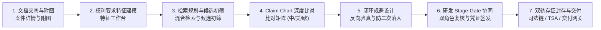

# PatentEvidence 🛡️

PatentEvidence 是一个面向**锂电与储能产业链（涵盖结构件与材料化工）**、服务于**企业知识产权部（IP）与研发团队（R&D）**的高保障企业级 SaaS 平台。目标产品是“证据级” FTO 与规避设计工作流：针对他人权利要求的 Claim Chart、闭环反向验真规避设计、研发/IP 双角色 Stage-Gate 门禁、双轨可信时间戳存证（见 [ADR 0004](./docs/adr/0004-fto-design-around-supersedes-agency-assessment.md)）。

> **实现状态：** 上述能力中相当一部分**尚在规划、未实现**。目前已具备：平台底座（多租户、RLS、MFA、审计）、案件录入、特征建模、比对矩阵、复核与交付门禁、证据快照封存及可复核的 DOCX/PDF 导出。混合检索、FTO 侵权规则包、规避设计、可信时间戳、BYOK 与 Stage-Gate 通行凭证均未实现。下文每项能力按 2026-10-04 的代码核对结果标注 **【已实现】**、**【部分实现】** 或 **【规划中】**。

> **语言说明：** 本中文版为功能与操作说明的完整中文呈现。权威领域术语定义见 [`CONTEXT.md`](./CONTEXT.md)。完整实施蓝图见 [`docs/plans/2026-fto-design-around-master-plan.md`](./docs/plans/2026-fto-design-around-master-plan.md)。英文原版见 [`README.md`](./README.md)。

---

## 🏛️ 四重竞争壁垒 — 目标，均为【规划中】

以下为总体规划中的目标壁垒，目前均未实现；其中专利件数为规划数字，尚未经核实（见 ADR 0004“待核实事项”）。

1. **数据壁垒（垂直特征级标注库）**：聚焦锂电与储能领域出海常态诉讼 Top 15 头部巨头近 5 年核心有效专利（5,000~8,000 件），建立细粒度结构与材料特征级标注底座。
2. **算法壁垒（闭环反向验真引擎）**：生成规避建议后，自动将修改方案反向置入竞品完整权利要求树与同族专利池跑二次比对，彻底防范“二次落入”风险。
3. **信任与合规壁垒（双轨司法时间戳锚定）**：中国境内对接权威司法链/可信时间戳，海外出海对接国际 RFC 3161 TSA 与公链哈希，满足海内外法庭与 337 调查的严格质证要求。
4. **工作流壁垒（研发 Stage-Gate 门禁流）**：研发提方案与规避整改，IP 工程师复核与终审封存，输出不可逆的《FTO 清障通行凭证》，深度嵌入企业研发与立项生命周期。

---

## 🚀 核心产品能力与工作流


```mermaid
graph LR
    A["1. 文档交底与附图<br/>案件详情与附图"] --> B["2. 权利要求特征建模<br/>特征工作台"]
    B --> C["3. 检索规划与候选初筛<br/>混合检索与候选初筛"]
    C --> D["4. Claim Chart 深度比对<br/>比对矩阵 (中/美/欧)"]
    D --> E["5. 闭环规避设计<br/>反向验真与防二次落入"]
    E --> F["6. 研发 Stage-Gate 协同<br/>双角色复核与凭证签发"]
    F --> G["7. 双轨存证封存与交付<br/>司法链 / TSA / 交付网关"]
```

1. **多租户与平台治理（Identity & Platform Governance）**
   - 【已实现】机构隔离（PostgreSQL FORCE RLS）、只追加审计日志；12 小时会话、TOTP 双因素（MFA Step-Up）、一次性恢复码、72 小时单次邀请。
   - 【规划中】客户自管密钥（BYOK）与密文存储（`adapters/secret-store` 目前仅为占位）；大模型敏感度双路由与零数据留存（当前为单一 OpenAI 兼容客户端）。

2. **案件录入与说明书附图（Case Intake & Drawings）**
   - 【已实现】DOCX/PDF 上传与服务端内容检查（真实类型、大小、宏/DDE/远程模板/PDF 动作等；常见主动内容接收并记录）；解析版本与 SHA-256。
   - 【已实现】附图提取（每幅附图独立 SHA-256）、权利要求编号关联（独权/从权标识）、附图规范静态检查（术语漂移、悬空标号、未定义标号）。
   - 【部分实现】附图 OCR 依赖宿主机 `tesseract`；API 镜像未安装该程序，生产镜像中 OCR 不运行。附图标号识别准确率尚无评测数据，不作表述。

3. **技术特征建模（Feature Modeling）**
   - 【已实现】特征拆解（F1~Fn）、前序/表征分类与段落原文锚定；草稿态拆分/合并/新增，确认后锁定为不可变版本。
   - 【规划中】FTO 所需的“第三方权利要求要素”模型（按权利要求树逐要素拆解）。

4. **检索与候选初筛（Retrieval & Screening）**
   - 【已实现】检索策略与任务、EPO / USPTO 适配器、CNIPR 人工交接、候选文献初筛记录。
   - 【规划中】垂直专利库；向量检索 + BM25 + 分类号过滤的混合召回与 Cross-Encoder 重排（目前无 pgvector、无中文分词）；研发白话方案自动解构。

5. **逐特征比对矩阵（Comparison Matrix）**
   - 【已实现】特征 × 对比文献的二维比对矩阵，三态判定（相同公开 / 等同替代 / 存在差异）及引证位置录入。当前语义为可专利性比对（申请方案特征 vs 现有技术）。
   - 【规划中】FTO 侵权比对（他人有效权利要求各要素 vs 己方方案）及中国 / 美国 / 欧洲（UPC、德国）法域规则包。具体判定规则须由规则包定义并经专业人员审定。

6. **闭环反向验真规避设计（Design-Around & Auto-Validation）**
   - 【规划中】针对断点特征生成替代/削减建议，并自动回比从属权利要求树与同族专利池。

7. **可专利性预评估规则层（Patentability Assessment Rules）** — 【已实现，已冻结】
   - 确定性规则（`assessment-rules-v3`）：优先权核验 → 文献日期门禁 → 新颖性单篇全覆盖门禁、组合覆盖筛查、证据完备度核查与创造性三步法脚手架；评估版本快照仅追加不可改。按 ADR 0004，该模块不再扩展。

8. **复核门禁与双角色协同（Review & Stage-Gate）**
   - 【已实现】多轮提审（`round_number`）、复核决定与逐项批注、案件级交付门禁（须有已批准且无阻塞项的评估版本）。
   - 【规划中】研发/IP 双角色 Stage-Gate、《FTO 清障通行凭证》、与 ERP/PLM 的集成。

9. **证据封存与交付（Evidence Sealing & Delivery）**
   - 【已实现】证据快照封存：对规范化（键排序）JSON 计算单一 SHA-256 根哈希。注意：这不是 Merkle 树，不提供逐项包含性证明。
   - 【已实现】可复核导出：DOCX / PDF / 可打印 HTML，页脚含快照版本号与根哈希；同一快照导出字节确定，文件 SHA-256 经响应头返回并写入审计日志。交付记录含受控下载令牌。
   - 【规划中】国内司法链 / 可信时间戳与 RFC 3161 TSA 双轨存证、交付证书、外部持证律师复核签署。

---

## 📐 项目结构与技术栈

**技术栈**

| 层级 | 技术 |
| --- | --- |
| 后端 API | Python 3.12、FastAPI、SQLAlchemy (async)、Alembic |
| 后台 Worker | Python 3.12（异步任务处理） |
| 前端 | React 19、TypeScript、Vite |
| 数据库 | PostgreSQL 16（强制行级安全 RLS） |
| 对象存储 | MinIO（内容寻址证据对象） |
| 测试 | pytest（API/worker）、Vitest + React Testing Library（web） |
| 打包工具 | `uv`（Python）、`pnpm` workspaces（Node） |

**仓库目录结构**

```
apps/            可部署服务
  api/           FastAPI 应用（src、alembic 迁移、tests）
  web/           React + Vite 单页前端
  worker/        异步后台任务处理器
modules/         领域逻辑，一个能力一个包：
                 cases、features、feature-modeling、search、
                 comparison、evidence、reports、review、
                 retrieval、delivery、assessment、platform
packages/        跨应用共享库
scripts/         运维工具：种子、引导、verify-* 发布门禁
db/              数据库 schema、角色与 RLS 策略
docs/            ADR、API 规范、架构、合规与验证说明
provenance/      发布溯源与源码锁定工件
fixtures/        确定性测试夹具
```

---

## 🛠️ 本地开发与快速开始

### 1. 前置条件
- **Python 3.12+**（使用 `uv` 管理）
- **Node.js 20+** 与 **pnpm 9+**
- **PostgreSQL 16+**（支持行级安全 RLS）

### 2. 环境配置

```sh
# 1. 克隆仓库并配置环境文件
cp .env.example .env

# 2. 安装 Python 依赖
uv sync --no-install-project

# 3. 安装前端依赖
pnpm install
```

### 3. 运行验证套件

```sh
# 运行 API 单元测试
.venv/bin/pytest apps/api/tests/unit/

# 运行 PostgreSQL RLS 集成测试
./scripts/test-postgres.sh

# 运行前端 Vitest 套件
pnpm test:web

# 构建生产前端产物
pnpm build:web

# 运行脚手架与源码锁定发布门禁
.venv/bin/python scripts/verify-source-lock.py
.venv/bin/python scripts/verify-scaffold.py
.venv/bin/python scripts/verify-p0-02.py
.venv/bin/python scripts/verify-p0-e2e.py

# 校验 Docker Compose 配置
docker compose config > /dev/null
```

### 4. 启动开发环境

```sh
# 通过 Docker Compose 启动 PostgreSQL、API、Worker、Web 与 MinIO
docker compose up --build

# 或在本地单独运行前端开发服务器
pnpm --filter @patent-evidence/web dev --port 5173
```

环境启动后：

| 服务 | 默认地址 |
| --- | --- |
| Web（Vite + React） | `http://localhost:5173` |
| API（FastAPI，健康探针） | `http://localhost:8000`（`/health`） |
| MinIO 对象存储 | `http://localhost:9000`（控制台 `:9001`） |

端口可通过 `.env` 中的 `API_PORT`、`WEB_PORT` 等变量覆盖。

---

## 🏛️ 安全与治理准则

- **租户数据强隔离（租户隔离）**：所有数据库表均开启 PostgreSQL 行级安全（RLS），任何跨租户数据访问均在数据库层强制拒绝。
- **不可变审计链（不可变溯源）**：证据快照与复核决策均绑定 SHA-256 数字摘要，禁止物理修改或覆盖已有记录。
- **合规边界（CNIPR 人工交接）**：严格遵守 CNIPR 数据规范与人工交接隔离策略，确保法律证据链合法合规。

---

## 📚 文档与深入资料

更详细、权威的文档位于 [`docs/`](./docs) 目录下：

| 领域 | 位置 |
| --- | --- |
| 架构决策记录（ADR） | [`docs/adr/`](./docs/adr) |
| API 规范 | [`docs/api/`](./docs/api) |
| 系统架构与脚手架 | [`docs/architecture/`](./docs/architecture) |
| 合规与验证说明 | [`docs/compliance/`](./docs/compliance)、[`docs/validation/`](./docs/validation) |
| 运维手册与本地开发 | [`docs/operations/`](./docs/operations) |
| 规划与产品规格 | [`docs/plans/`](./docs/plans)、[`docs/product/`](./docs/product) |
| **实施蓝图 (Master Plan)** | [`docs/plans/2026-fto-design-around-master-plan.md`](./docs/plans/2026-fto-design-around-master-plan.md) |
| 领域语言术语表 | [`CONTEXT.md`](./CONTEXT.md) |

发布溯源与源码锁定工件保留于 [`provenance/`](./provenance)。

---

## 📄 许可证

© 2026 PatentEvidence 贡献者。版权所有。

本仓库为**专有且保密**内容，受 *PatentEvidence 商业许可* 约束。未经版权方另行书面协议，不得对本仓库任何部分进行使用、复制、修改、分发、再许可或出售。完整条款见 [`LICENSE`](./LICENSE)。

第三方组件保留其各自许可证，详见 [`provenance/THIRD_PARTY_NOTICES.md`](./provenance/THIRD_PARTY_NOTICES.md)。
