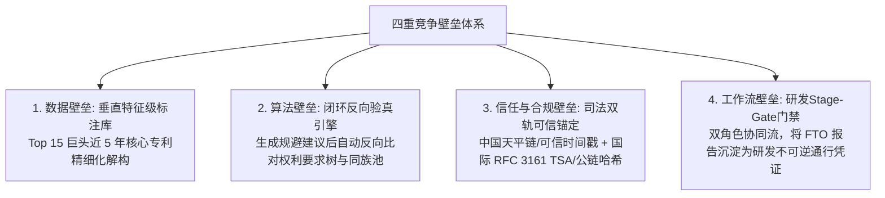
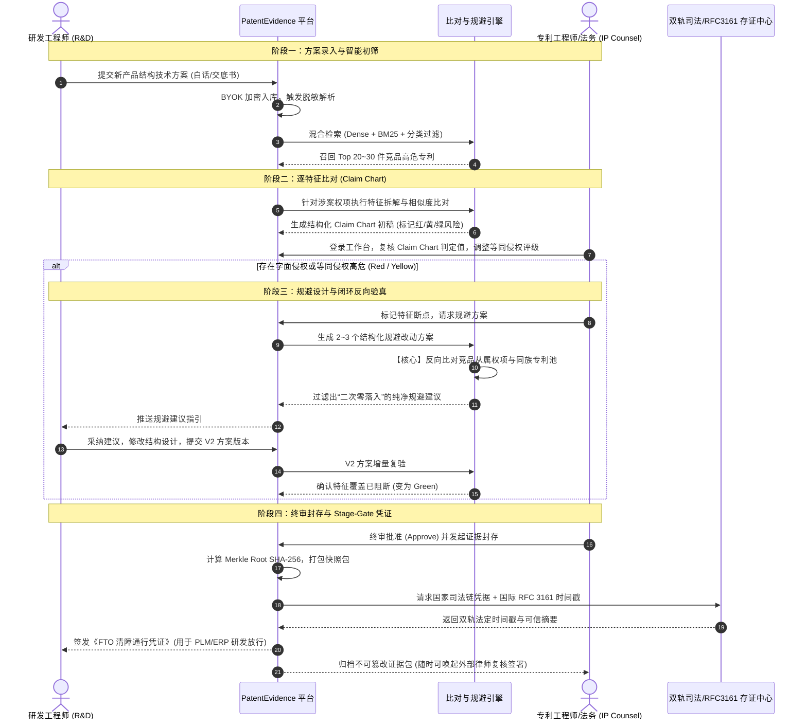
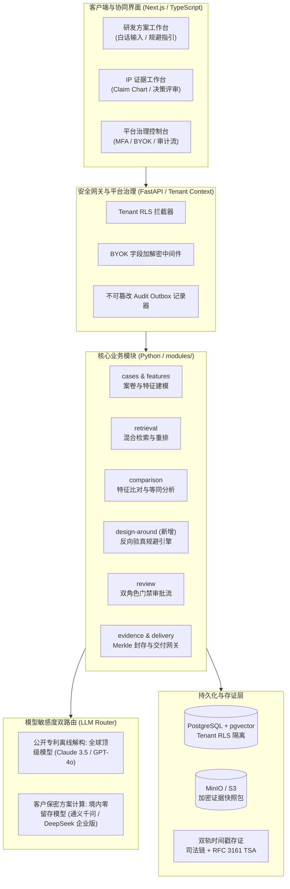
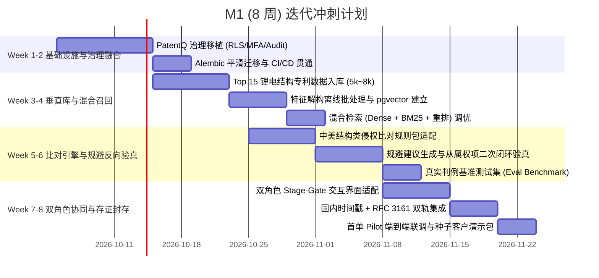

# 锂电与储能领域“证据级” FTO 与竞品规避平台设计与实施蓝图
## PatentEvidence · Enterprise Evidence-Grade IP & Design-Around Platform

> **实施勘误（2026-10-04）**：本规划已被采纳为产品主线（[ADR 0004](../adr/0004-fto-design-around-supersedes-agency-assessment.md)）。
> 经与代码核对，§5 / §6 中部分工程假设与现状不符（例如第 1–2 周的 PatentQ 治理移植已在 P0-02 完成；
> RLS 设置项为 `app.current_organization_id`；前端为 React + Vite）。以 ADR 0004“核对结果”为准。
> ADR 0004“待核实事项”所列内容（数据件数与来源、中国法律状态来源、各类供应方、判例基准集、M1 日程）
> 在取得实测数据或明确决定前不视为既定事实。
> **范围修订（2026-10-04）**：首期法域改为美国与欧洲，中国数据评估后再定；时间范围采用“当前可能有效”而非
> “近 5 年授权”；“核心专利”是预标注优先级而非检索范围，“Top 15 / 5,000~8,000 件”以实测为准。见
> [ADR 0005](../adr/0005-fto-corpus-time-scope-and-core-definition.md)。

---

## 1. 战略定位与四重竞争壁垒

本项目以 **PatentEvidence** 为核心代码底座，整合 **PatentQ** 的多组织与审计治理体系以及 **PatentForge** 的智能撰写能力，专注于打造国内首个面向**锂电与储能产业链（结构件 + 材料化工）**、服务于**企业知识产权部与研发团队**的“证据级”高保证 SaaS 平台。



---

## 2. 22 项系统决策共识矩阵

| # | 决策维度 | 选定方案 | 核心价值 / 设计边界 |
|---|---|---|---|
| **01** | 主线定位 | **证据级合规 + 竞品规避设计 (Design-Around)** | 不做泛化查新，深挖 FTO 与可经受法庭质证的规避闭环 |
| **02** | 核心客户 | **企业知识产权部 (IP) + 研发团队 (R&D)** | 直击高预算、高频立项出海场景 |
| **03** | 技术领域 | **新能源智能硬件 + 新材料化工** | 兼顾结构构件与化学组分/数值范围 |
| **04** | 首发切口 | **锂电与储能产业链** | 一条链打通结构件（电芯/模组/热管理）与化工（正负极/电解液/隔膜） |
| **05** | 部署形态 | **纯 SaaS** | 聚焦中腰部电池与储能出海企业，复用多租户隔离底座 |
| **06** | 信任机制 | **等保三级/ISO + BYOK 客户自管密钥 + 零数据留存** | 方案内容服务端加密，模型推理不保留数据 |
| **07** | 数据方案 | **公开源自建垂直库 + 客户自有结果导入** | 聚焦 CPC H01M / H02J，积累特征级专利资产 |
| **08** | 代码主干 | **以 PatentEvidence 为主干，融合 PatentQ** | 移植 PatentQ 治理底座，接入 PatentForge 撰写模块，归档其余库 |
| **09** | MVP 闭环 | **FTO 风险排查 + 规避设计** | 录入方案 → 初筛召回 → 逐特征比对 → 规避建议 → 证据封存 |
| **10** | 适用法域 | **中国 + 美国 + 欧洲** | 覆盖出海诉讼最密集的三个核心市场 |
| **11** | 欧洲规则 | **统一专利法院 (UPC) + 德国规则包先行** | 覆盖欧洲绝大部分诉讼风险，英国后续扩展 |
| **12** | 产出属性 | **双层机制（AI 报告自查 + 平台内持证律师复核）** | 平台不直接接案出意见，合规避险，支持律师入驻签署 |
| **13** | 模型路由 | **敏感度分级双路由** | 公开数据批处理用顶级模型；客户保密方案走境内零留存模型 |
| **14** | 准确率基线 | **真实公开判例标准答案集 + 专家抽检校准** | 以法院判例为锚点，公布客观准确率/召回率指标并按版本留档 |
| **15** | 商业模式 | **年度订阅（按 FTO 项目配额分档）+ 律师按次服务费** | 匹配企业年度预算，辅以竞品监控增值包 |
| **16** | 交付节奏 | **三阶段里程碑独立交付** | M1(中/美/结构类) → M2(化工/数值范围) → M3(欧洲/律师签署) |
| **17** | 规避机制 | **闭环反向验真机制** | 建议方案反向自动比对从属权项与同族池，防范二次落入 |
| **18** | 法律锚定 | **国内司法链 + 国际 RFC 3161 TSA / 公链双轨存证** | 确保证据在海内外法庭及 337 调查中的法定证明力 |
| **19** | 协作机制 | **研发/IP 双角色门禁流 (Stage-Gate)** | 研发提交与规避，IP 复核与终审，输出立项开模绿灯凭证 |
| **20** | 冷启动规模 | **Top 15 头部巨头近 5 年核心有效专利 (5,000~8,000 件)** | 宁德/比亚迪/特斯拉/LGES 等核心主体，高信噪比 |
| **21** | 初筛召回 | **混合检索 (Dense + BM25 + 分类过滤) + Cross-Encoder 重排** | 解决研发白话输入问题，严格防范 FTO 漏检 |
| **22** | 工程整合 | **PatentEvidence 增量平滑追加** | 保留原生 Alembic 迁移链与模块边界，追加 RLS 与审计中间件 |

---

## 3. 业务全景与双角色 Stage-Gate 流程



---

## 4. 系统技术架构与模型双路由



---

## 5. PatentEvidence 与 PatentQ 代码库整合方案

### 5.1 目录组织演进
保持 `PatentEvidence` 的 pnpm workspace + Python backend monorepo 结构：
```text
PatentEvidence/
├── apps/
│   ├── web/                     # 前端应用 (Next.js, 承载研发与 IP 双工作台)
│   └── docs/                    # 规范与说明文档
├── modules/
│   ├── platform/                # 【从 PatentQ 移植】多租户、MFA、应急访问、组织管理
│   ├── cases/                   # 案卷与方案元数据
│   ├── features/                # 权利要求与方案技术特征模型
│   ├── retrieval/               # 混合检索、BM25与向量召回
│   ├── comparison/              # 逐特征 Claim Chart 比对引擎与规则包
│   ├── design_around/           # 【新模块】规避建议生成与闭环反向验真
│   ├── review/                  # 双角色审批、Stage-Gate 门禁流
│   ├── evidence/                # Merkle Tree、存证快照打包
│   └── delivery/                # 客户交付网关与在线验证页
├── adapters/
│   ├── auth/                    # 【从 PatentQ 移植】JWT, MFA, RLS 上下文适配器
│   ├── secret_store/            # BYOK 客户密钥解密适配器
│   ├── llm/                     # 敏感度双路由 LLM 客户端
│   ├── tsa/                     # 【新增】司法链与 RFC 3161 时间戳客户端
│   └── vector_store/            # pgvector / 检索适配器
├── db/
│   └── alembic/                 # 统一迁移脚本（在原迁移上平滑追加 RLS 与审计）
```

### 5.2 数据库迁移平滑演进路径
1. **0001~000X（现存迁移）**：保留 PatentEvidence 现有的 cases, features, comparisons, evidence 表。
2. **新增迁移 000X+1**：移植 PatentQ 的 `tenants`, `memberships`, `mfa_credentials`, `audit_events` 表。
3. **新增迁移 000X+2**：在核心业务表上启用 PostgreSQL `ENABLE ROW LEVEL SECURITY`，注入 `app.current_tenant_id` 策略。
4. **新增迁移 000X+3**：增加 `design_around_candidates`, `stage_gate_passes`, `tsa_certificates` 表。

---

## 6. M1（里程碑一）8 周落地实施规划

**目标**：8 周内打通中国 + 美国结构类专利的“方案录入 → 混合检索 → Claim Chart 判定 → 规避反向验真 → 双轨存证封存”完整闭环，达到可向 2~3 家锂电出海企业进行付费 Pilot 演示与交付的标准。



---

## 7. 下一步实施准备确认

此规划已固化前述全部 22 项决策，形成了闭环的产品架构与技术路线。请确认本方案是否完整符合您的预期。确认后，我们将正式进入代码与工程执行阶段。
